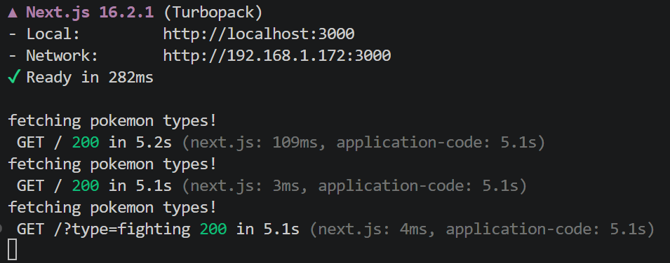
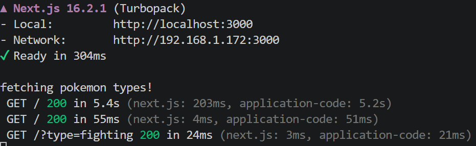

# Next.js Server-Side Caching with React Query Prefetch + Dehydration

This is a Next.js example project that demonstrates how to solve the "fetch trigger when navigating" problem when using prefetch queries that stream to the client side.
It uses the [PokeAPI](https://pokeapi.co/) for example purposes.

It has an infinite scrolling table with all the Pokémon names/IDs and, on the top, a select to filter the Pokémon by Type. Those types are loaded by a prefetch query. When a type is selected, it appends to the Search Params and the filtered data is loaded in the table.

## The Problem

If your Next.js page has a prefetch query, it will fetch on the server and will dehydrate on the client side. This is done by React Query (more at https://tanstack.com/query/latest/docs/framework/react/guides/advanced-ssr).

This example is using the Streaming strategy, so "look ma, no await" (thanks @tkdodo for this comment)! That means the query starts on the server, Next.js streams any part that is ready to show, while loading (Suspense) anything that is pending. When the prefetched query is ready, it will stream the data to the client.

So far so good! Well... until you navigate! Let's say a page has a table with some data, and some filters to be applied. Every time a filter is applied, it updates the Search Params in the URL. That means, a navigation happens! The render will come from the Server (Next.js way to do it) and... YES, EXACTLY! Our prefetch query will fetch again! Since our client side has cached data already, the only downside here is fetching again and flooding our server and the target API.



## The Solution

That is the fun part I discussed with Dominik Dorfmeister at the React Paris conference! While [Tanstack Start](https://tanstack.com/start/latest) solves that already, for Next.js probably the simplest solution is to cache the response received in the prefetch query in a storage (Redis or in-memory, e.g.). When the prefetch happens again (by navigation, for example), we check if there's anything in the cache and just return from it, avoiding the unnecessary fetch!



```ts
queryClient.prefetchQuery({
  queryKey: [QUERY_KEYS.POKEMON_TYPES],
  queryFn: async () => {
    const cached = await storage.getItem(QUERY_KEYS.POKEMON_TYPES);
    if (cached) return JSON.parse(cached);

    const data = await api.getPokemonTypes();
    await storage.setItem(QUERY_KEYS.POKEMON_TYPES, JSON.stringify(data));

    return data;
  },
});
```

## Query Key

An interesting point is to note that the Server Cache shares the same Query Key. But that can be a mess depending on what you want to cache. **REMEMBER**, this is on the server and is shared between users!
If the data can be shared across users (common list of data, for example), that can work with no changes. BUT, if you are prefetching something that is UNIQUE per user, you might need another strategy here!

Some initial thoughts to fix this are probably using a combination of the User ID with the Query Key... This is another place that I want to go explore next too!

## Stale Time

One thing to be aware of is the Stale Time. The Cache time in the Server Storage must match the same Stale Time defined in the QueryClient. Otherwise mismatches may happen and we don't want that!

This is done by the constant `MAX_STALE_TIME`.

### persistQueryClient

I know it is possible to use [persistQueryClient](https://tanstack.com/query/latest/docs/framework/react/plugins/persistQueryClient), more specifically the combination of `persistQueryClientRestore` and `persistQueryClientSave`. But for simplicity, I opt to do the `if` in the `queryFn` just to demonstrate the main idea. Ideally, we would want that to be done by React Query persisters.

Plus, as explained in the Query Key session, we might need a strategy here to dehydrate in the correct query key if a unique per user key is used. Probably the Storage will have one, and we map it back when resolving? Another interesting case to approach!

Also, I didn't check it in depth, but the last time I used them, the `await` was needed, and that kills the idea of streaming. Maybe that is the next step I will check in combination with https://github.com/tanstack/query/blob/main/docs/framework/react/guides/advanced-ssr.md#using-the-persist-adapter-with-streaming.

## Key Files

- `app/page.tsx`: Server entrypoint that prefetches and dehydrates.
- `app/_services/prefetch-pokemon-types.ts`: Prefetch the Pokemon Types and cache it in the server.
- `app/_providers/get-query-client.ts`: QueryClient config, stale time, and dehydration behavior. Default config from https://tanstack.com/query/latest/docs/framework/react/guides/advanced-ssr.
- `app/_providers/providers.tsx`: Client QueryClientProvider wrapper. Default config from https://tanstack.com/query/latest/docs/framework/react/guides/advanced-ssr.
- `app/_storage/storage.ts`: Storage driver selection (Redis vs local in-memory).
- `app/_storage/redis-storage.ts`: Redis implementation.
- `app/_storage/in-memory-storage.ts`: In-memory fallback with manual expiration.
- `app/_constants/cache.ts`: Shared stale time constant.
- `app/_constants/query-keys.ts`: Centralized query keys.

## Checking and Running the Project

There is a `console.log` in the API used by the prefetch: `fetching pokemon types!`. If you disable the server cache in the `app/_services/prefetch-pokemon-types.ts` file, you will notice that every time you filter by a type, this console log will appear!

`npm run dev` and have fun checking the logs!
